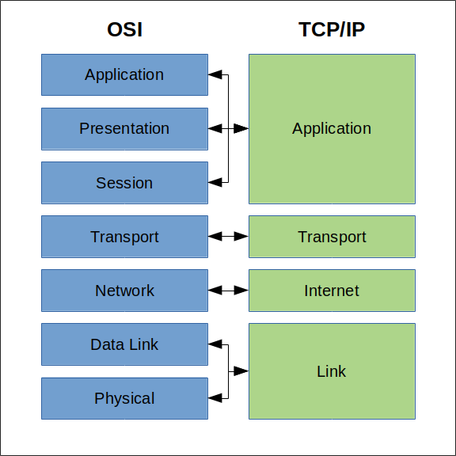
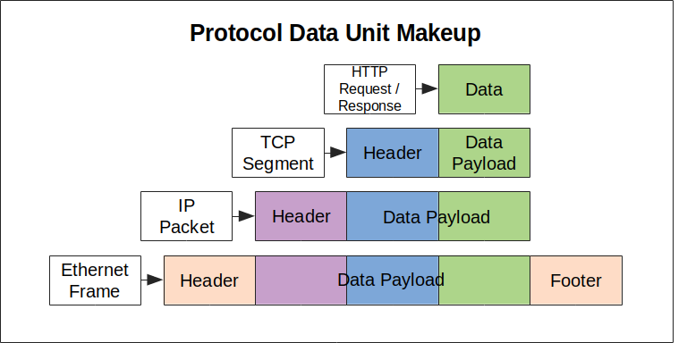
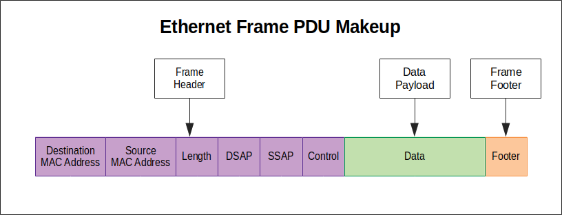

# Networking Foundations

## Protocols
---

**KEYWORDS** 
**Protocol** - a set of rules governing the exchange or transmission of data for network communication.

---

Some examples of protocols developed.

To address different aspects of network communication.
- structure of a message
- flow and order of all the messages
- message transfer rules

To address the same aspect of network communication but in a different way or for a specific use-case.
- discussion between student and teacher
- discussion between friends
- discussion presentation at conference

## Layer System
Trying to understand the overall system of communication can be dauting. Instead
we can break it up into layers ie group of protocols. By focusing on these
layers we can target our understanding.

Two of the most popular model which describe computer network communication are
**OSI(Open Systems Interconnection) vs TCP/IP(Transmission Control Protocol/Internet Protocol)**

The difference between the models are that they each take a different approach
describing network communitication. The **IP** model divides the layers in terms
of the scope of communications within each layer (within a local network,
between networks, etc). The **OSI** model divides the layers in terms of the
functions that each layer provides (physical addressing, logical addressing and
routing, encryption, compression, etc).

Groups of protocols work in a layered system. Protocols at one layer provide
services to the layer above.

## Data Encapsulation
Just like in Ruby, data is "encapsulated" to prevent access from outside of the
encapsulated object. How is this accomplished in Network Communications?

### Protocol Data Units(PDU)
Protocol Data Units(PDU) are a block of data transfered over a network. Different protocols or layers call PDU by different names.
- At the Link/ Data Link layer, it is known as a frame.
- At the Internet/ Network layer, it is known as a packet.
- At the Transport layer, it is known as a segment (TCP) or datagram (UDP).

A PDU consist of a
- header
- a data payload
- footer/trailer, not always

### Header and Trailer
The exact structure of the header and/or trailer varies from protocol to
protocol, but their purpose is to provide protocol-specific metadata about
the PDU. For example, an Internet Protocol (IP) packet header would include
fields for the Source IP Address and the Destination IP Address, which would be
used to correctly route the packet.

### Data Payload
The data payload portion of a PDU is simply the data that we want to transport
over the network using a specific protocol at a particular network layer.

The data payload is the key to the way encapsulation is implemented. The entire
PDU from a protocol at one layer is set as the data payload for a protocol at
the layer below. For example, a HTTP Request at the Application layer could be
set as the payload for a TCP segment at the transport layer. This creates
separation between the protocols at different layers

## Physical Network

### Characteristics of the Physical Network

#### The Elements of Latency
**Latency** 
The time it takes for data to get from one point to another in a network.

- Propagation Delay 
  The amount of time it takes message to travel from the sender to the receiver.

- Transmission Delay 
  The amount of time it takes to push data onto the link. Think of link as all the wires, cables and routers the data travels.

- Processing Delay 
  The amount of time it take to process the data between links

- Queuing Delay 
  The amount of time data is in buffer before the preceding data is processed

- Last-mile latency 
  The part of the network that transition from public internet access from
  internet provider to you private in home network.

- Round Trip Time (RTT) 
  Time of length for a signal to be sent and a response that the signal was
  sent.

#### The Bandwidth Elements
**Bandwidth** 
The amount of data over set time that gets from point to another in a network.

Bandwidth varies across networks and is not going to be at a constant level and as developers there is little you can do about the limitations of the physical network.

- Bandwidth Bottleneck 
  A point at which bandwidth changes from relatively high to relatively low level.

## The Link/ Data Link Layer
Physically connecting devices is not enough for them to communicate. We have to
establish rules to communicate. One of the most important rules for transferring
data from one place to another is identifying the device to which we want to
end that data. The protocols operating at this layer are primarily concerned
with the identification of devices on the physical network and moving data over
the physical network between the devices that comprise it, such as hosts (e.g.
computers), switches, and routers.

The most commonly used protocol at this layer is the Ethernet protocol. Ethernet
cables are network cables used to connect devices on the network such as
computers, switches, and routers. The technical specification of these cables is
governed by the same IEEE standards that include the Ethernet communication
protocols that operate at this layer of the network.

Two of the most important aspects of Ethernet are **framing** and **addressing**.

### Ethernet Frames - PDU
Ethernet Frames are a Protocol Data Unit, and encapsulate data from the Internet
/Network layer above. The Link/Data Link layer is the lowest layer at which
encapsulation takes place. At the physical layer, the data is essentially a stream
of bits in one form or another without any logical structure. An Ethernet Frame
adds logical structure to this binary data. The data in the frame is still in the
form of bits, but the structure defines which bits are actually the data payload,
and which are metadata to be used in the process of transporting the frame.

An Ethernet-compliant network device is able to identify the different parts of a
frame due to the fact that different 'fields' of data have specific lengths in
bytes and appear in a set order.

**Preamble & SFD** 
The Preamble and Start of Frame Delimiter (SFD/ SOF) generally aren't considered
part of the actual frame but are sent just prior to the frame as a synchronization
measure which notifies the receiving device to expect frame data and then identify
the start point of that data.

**Source & Destination MAC Address**
The next two fields, each six bytes (48 bits) long, are the source and destination
MAC addresses. The source address is the address of the device which created the
frame. The destination MAC address is the address of the device for which the
data is ultimately intended. MAC Addresses are a key part of the Ethernet protocol

**Length**
The length field is two bytes (16 bits) in length. It is used to indicate the
size of the Data Payload

**DSAP, SSAP, Control**
The next three fields are all one byte (8 bits) in length. The DSAP and SSAP
fields identify the Network Protocol used for the Data Payload. The Control field
provides information about the specific communication mode for the frame, which
helps facilitate flow control.

**Data Payload**
The data payload field can be between 42 and 1497 bytes in length. It contains
the data for the entire Protocol Data Unit (PDU) from the layer above, an IP
Packet for example.

**Frame Check Sequence (FCS)**
The final four bytes (32 bits) of an Ethernet Frame is the Frame Check Sequence.
This is a checksum generated by the device which creates the frame. It is
calculated from the frame data using an algorithm such as a cyclic redundancy
check. The receiving device uses the same algorithm to generate a FCS and then
compares this to the FCS in the sent frame. If the two don't match, then the frame
is dropped. Ethernet doesn't implement any kind of retransmission functionality
for dropped frames; it is the responsibility of higher level protocols to manage
retransmission of lost data if this is a requirement of the protocol.

**Interframe Gap (IFG)**
This IFG is a brief pause between the transmission of each frame, which permits the receiver to prepare to receive the next frame. The length of this gap varies according to the capability of the Ethernet connection.

### MAC Addresses
Every network-enabled device, e.g. a Network Interface Card (NIC) that you would find in a PC or laptop, is assigned a unique MAC Address when it is manufactured. Since this address is linked to the specific physical device, and (usually) doesn't change, it is sometimes referred to as the physical address or burned-in address. MAC Addresses are formatted as a sequence of six two-digit hexadecimal numbers, e.g. 00:40:96:9d:68:0a, with different ranges of addresses being assigned to different network hardware manufacturers.

> Insert image 

If you used a hub, the frame would be sent to every computer and the destination computer would either accept or reject the frame. Modern networks use switches which are like smart hubs, it sends the frame to only the destination computer. The switch keeps track of address on a MAC Address Table.

MAC addressing works well for local system and doesn't scale well due to. Ie global scale.
- They are physical rather than logical. Each MAC Address is tied (burned in) to
  a specific physical device
- They are flat rather than hierarchical. The entire address is a single sequence
  of values and can't be broken down into sub-divisions.

## Internet / Network Layer
The primary function of protocols at this layer is to facilitate communication between hosts (e.g. computers) on different networks. There are two versions of IP currently in use: IPv4 and IPv6, but both offer routing capability via IP addressing and encapsulation of data into packets.

### Data Packets - PDU
The Protocol Data Unit (PDU) within the IP Protocol is referred to as a packet.
A packet is comprised of a Data Payload and a Header. Just as with Ethernet
Frames, the Data Payload of an IP Packet is the PDU from the layer above (the
Transport layer). It will generally be a TCP segment or a UDP datagram. The
Header is split into logical fields which provide metadata used in transporting
the packet. Again, as with Ethernet Frames, the data in the IP Packet is in bits.
The logical separation of those bits into header fields and payload is determined
by the set size of each field in bits and the order within the packet.

> Insert Image 

**Version** 
  The version of the Internet Protocol used, e.g. IPv4

**ID, Flags, Fragment Offset** 
  These fields are related to fragmentation. If the Transport layer PDU is too large to be sent as a single packet, it can be fragmented, sent as multiple packets, and then reassembled by the recipient.

**TTL** 
  Every packet has a Time to Live (TTL) value. This is to ensure that any packets which don't reach their destination for some reason aren't left to endlessly bounce around the network. The TTL indicates the maximum number of network 'hops' a packet can take before being dropped. At each hop, the router which processes and forwards the packet will decrement the TTL value by one.

**Protocol** 
  This indicates the protocol used for the Data Payload, e.g. TCP, UDP, etc.

**Checksum** 
  This is an error checking value generated via an algorithm. The destination device generates a value using the same algorithm and if it doesn't match, it drops the packet. IP doesn't manage retransmission of dropped packets. This is left to the layers above to implement.

**Source & Destination Address** 
  The 32-bit IP address of the source and destination of the packet.

### IP Addresses
IPv4 addresses are 32 bits in length and are divided into four sections of eight bits each. When converted from binary to decimal, each of those sections provides a range of numbers between 0 and 255 (since 2 to the power of 8 equals 256). For example `109.156.106.57`. IPv6 is a newer address protocol which create a larger address pool. It also has slightly different address structure

A basic example of this hierarchy in action would be if all the addresses in the range `109.156.106.0` to `109.156.106.255` were assigned to a single local network. Each network defines the address at the start of the range, e.g. `109.156.106.0`, as the network address, and the address at the end of the range, e.g. `109.156.106.255`, as the broadcast address. Addresses between the network and broadcast address, `109.156.106.1` to `109.156.106.254`, can be allocated to individual devices on the network.

### Routing and Routing Tables
All routers on the network store a local routing table. When an IP packet is received by a router, the router examines the destination IP address and matches it against a list of network addresses in its routing table. As explained above, these network addresses define a range of addresses within a particular subnet. The matching network address will determine where in the network hierarchy the subnet exists. This will then be used to select the best route for the IP packet to travel.

## SUMMARY
- Protocols act as systems of rules for network communication.
- Groups of protocols work in a layered system. Protocols at one layer provide
  services to the layer above.
- Data is encapsulated into a Protocol Data Unit, creating separation between
  protocols operating at different layers.
- Ethernet Protocol provides communication rules between device on same network
- Internet Protocol provides communication rules between devices on the global
  network.
- The internet is a vast network of networks. It is comprised of both the network infrastructure itself (devices, routers, switches, cables, etc) and the protocols that enable that infrastructure to function.

- Protocols are systems of rules. Network protocols are systems of rules governing the exchange or transmission of data over a network.

- Different types of protocol are concerned with different aspects of network communication. It can be useful to think of these different protocols as operating at particular 'layers' of the network.

- Encapsulation is a means by which protocols at different network layers can work together.

- Encapsulation is implemented through the use of Protocol Data Units (PDUs). The PDU of a protocol at one layer, becomes the data payload of the PDU of a protocol at a lower layer.

- The physical network is the tangible infrastructure that transmits the electrical signals, light, and radio waves which carry network communications.

- Latency is a measure of delay. It indicates the amount of time it takes for data to travel from one point to another.

- Bandwidth is a measure of capacity. It indicates the amount of data that can be transmitted in a set period of time.

- Ethernet is a set of standards and protocols that enables communication between devices on a local network.

- Ethernet uses a Protocol Data Unit called a Frame.

- Ethernet uses MAC addressing to identify devices connected to the local network.

- The Internet Protocol (IP) is the predominant protocol used for inter-network communication.

- There are two versions of IP currently in use: IPv4 and IPv6.

- The Internet Protocol uses a system of addressing (IP Addressing) to direct data between one device and another across networks.

- IP uses a Protocol Data Unit called a Packet.
